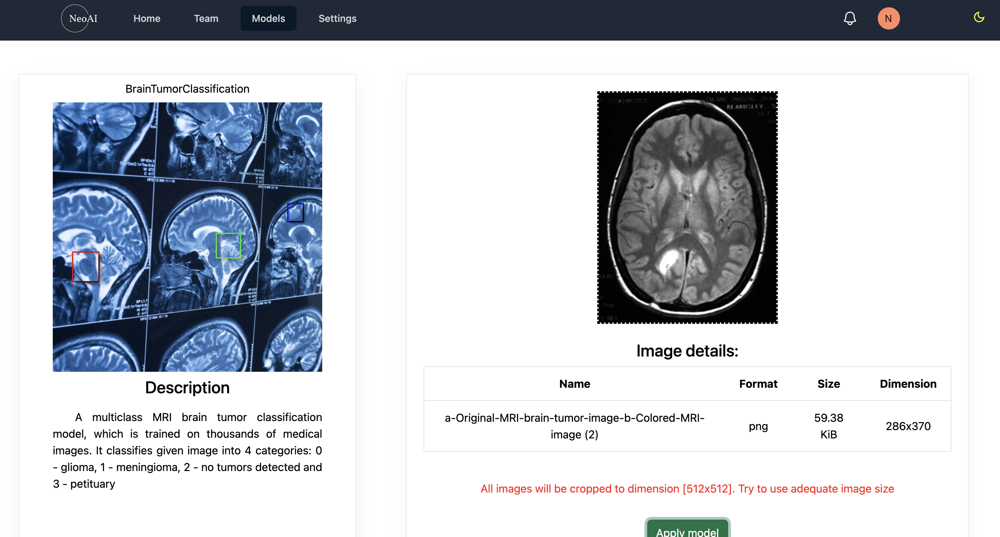

# **NeoAi: Open-Source Machine Learning Platform**

NeoAi is an open-source web application designed to empower users in the realm of machine learning. The platform provides a seamless experience for leveraging built-in machine learning models, storing and managing personal models, and tailoring them to individual needs. Still in active development, NeoAi is committed to provide access to machine learning capabilities and fostering a collaborative community of developers, researchers, and enthusiasts.

<!-- > [!IMPORTANT]
> This project is still under development. Any contributions are welcomed! -->

## Links
- [**NeoAi: Open-Source Machine Learning Platform**](#neoai-open-source-machine-learning-platform)
  - [Links](#links)
  - [Features](#features)
  - [Contribution](#contribution)
  - [License](#license)

## Features
- Built-in Models: Access a variety of pre-trained machine learning models to jumpstart your projects.

- Model Storage: Seamlessly store and organize your own machine learning models directly on the platform. **(to implement)**

- Customization: Tailor and fine-tune models to suit your specific requirements, fostering a personalized and adaptive approach to machine learning. **(to implement)**

- User-Friendly Interface: Enjoy a user-friendly web application interface that simplifies complex machine learning tasks and workflows.

## Contribution

How to Contribute:
1) Fork the Repository: Start contributing by forking the NeoAi repository.

2) Clone Locally: Clone the forked repository to your local machine.

3) Hack Away: Contribute to NeoAi by fixing bugs, adding new features, or improving existing ones.

4) Submit Pull Requests: Share your contributions by submitting pull requests. Collaborative efforts to enhance the platform are welcomed.

Let's try to shape the future of machine learning together with NeoAi!

## License
Distributed under the MIT License. See LICENSE for more information.